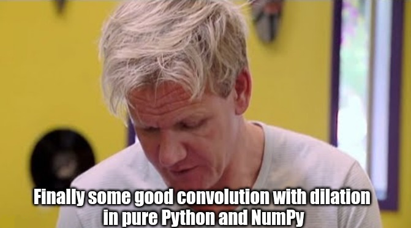
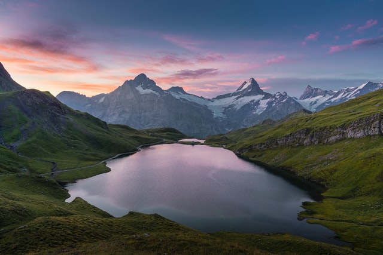

# Convolution from scratch  
  
### Motivation on repository
I tried to find the algorithm of convolution with dilation, implemented from scratch on a pure python, but could not find anything. There are a lot of self-written CNN on the Internet and on the Github and so on, a lot of tutorials and explanations on convolutions, but there is a lack of a very important thing: proper implementation of a generalized 2D convolution for a kernel of any form with adjustable on both axes such parameters as stride, padding, and most importantly, dilation.The last one cannot be found anywhere. This is why this repository and this picture above appeared.
### Who needs this?
If you've ever wanted to understand how this seemingly simple algorithm can be really implemented in code, this repository is for you. As it turns out, it's not so easy to tie all the parameters together in code to make it clear and obvious (and optimal in terms of computations).  
Feel free to use it as you wish.
<!-- ## Explanation
Idea in the nutshell: in 2D convolution we move some small matrix called Kernel over 2D image (some matrix) and multiply it element-wise over each sub-matrix, then summing elements of obtained sub-matrix into a single pixel of so-called "feature map". Just like in the GIF [(source)](https://stackoverflow.com/questions/42450389/how-a-filter-in-convolutional-neural-network-can-generate-multiple-channels) below:

  

First of all, let's clarify it and give a definition to every term used:
- Input data or Image is some matrix;
- Kernel is a small matrix that we multiply with sub-matrices of an image;
- Stride is the size of the step of the slide. So when the stride equals 1, we move 1 pixel to the right on every step, when 2, we move 2 pixels and so on;
- Padding is -->
## Usage 
<!-- ###  -->
### Example of usage in daily life situations
For example, if you want to blur your image, you can use [Gaussian blur](https://en.wikipedia.org/wiki/Gaussian_blur) and take corresponding kernel, while some others can be found [here](https://en.wikipedia.org/wiki/Kernel_(image_processing)).
```python
import numpy as np
import imageio


gaussian_blur = np.array([
    [1, 2, 1],
    [2, 4, 2],
    [1, 2, 1]
]) / 16


image = imageio.imread('files/pic.jpg')
plt.imshow(image, aspect='auto')
```


Then you need just to use function `apply_filter_to_image` from `convolution.py` module:
```python
filtered_image = apply_filter_to_image(image, gaussian_blur)
plt.imshow(filtered_image, aspect='auto')
```


> P.S. This photo is taken near the alpine lake Bachalpsee in Switzerland. Photo is under free license.

